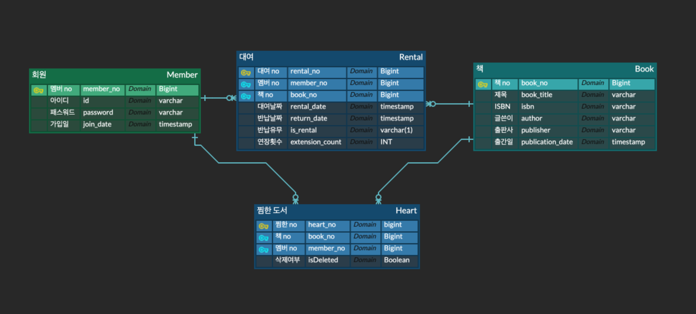

# 도서 대여 서비스 RenBook

 

개발기간 : 2024.05 ~ 2024.06
---

# 1. 개발 환경

Front : `BootStrap5` `CSS`  
Backend : `Spring` `Jpa` `MySql`

# 2. 주요 기능

- `베스트 도서`와 `신간 도서` 표시
  - 매월 대여 횟수로 베스트 도서 선정
  - 도서 출판일에 따른 신간 도서
  
- `도서 대여` 및 `찜하기`
  - 찜목록 또는 도서 상세 화면에서 대여하기, 찜하기 가능
  - 다른유저가 대여하고있는 도서는 대여불가
- `회원 가입` 및 `로그인`
  - 회원 가입 및 로그인시 아이디와 비밀번호 `검증`
  - 대여 및 찜하기 기능은 `로그인 후 사용가능`
  - 로그인 하지 않은 상태에서 대여목록, 찜목록 접근시 `로그인 요구`
  - 대여 목록, 찜목록에서 자신이 추가한 도서 목록 확인 가능
- 제목, 작가, 출판사를 검색하여 `도서검색` 가능

# 3. 스크린 샷
- 메인 화면

- 로그인 화면

- 도서 상세 정보 화면

- 대여 목록 화면

- 검색 화면

# 4. ERD

# 5. 느낀점
- 이번 프로젝트에서는 `Mysql` `AWS` 를 적용해보았다.
- `AWS` 는 특히 매번 로컬에서만 작동 시키던 프로젝트를 외부에서 구동해본 경험이 되었다.
  - git pull 하던 중 EC2 인스턴스에서 mysql을 구동한뒤 ./gradlew build 를 하면 계속 인스턴스가 멈춰서 재부팅을 자주했다.
  - mysql을 구동하지않고 빌드한 뒤 mysql을 구동하고 프로젝트를 시작하니 프로젝트가 잘 동작하였다.
  - EC2 인스턴스의 사양이 부족한건지 아직 원인은 잘모르겠다.
- 저번 프로젝트에서 `CSS` `Bootstrap5` 에 대해 적용해보았지만 이번 프로젝트에서도 시간을 조금 잡아먹은 것 같다.
